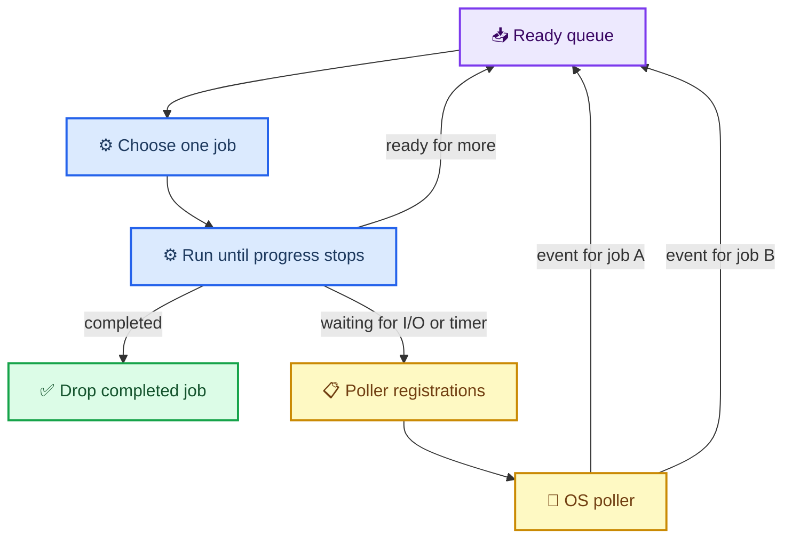
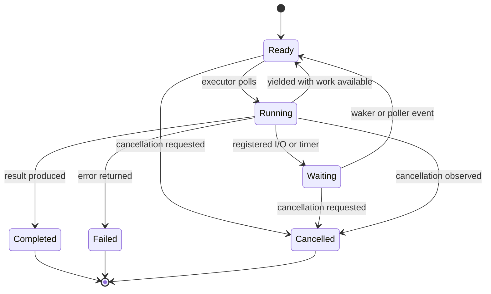

# Async code from first principles

_The event loop is a dispatcher for resumable state machines, not a magical faster thread._

---

Most explanations of asynchronous code begin with `async` and `await`. That is backwards. Those keywords are a convenient notation for a lower-level machine: a loop, an I/O poller, a queue of runnable jobs, and a set of suspended state machines that each own their own state.

Once you can see that machine, most async systems stop looking mysterious. Rust futures, Python's `asyncio`, Node's event loop, and libuv differ in details, but they are variations on the same arrangement.

The compact version is this:

> A job runs until it cannot make progress. It records where it stopped, registers what can wake it, and gets out of the way. The event loop runs another job. When the external event happens, the loop puts the original job back on the ready queue.

That is the whole trick. The rest is bookkeeping.

## Start with the problem: waiting is expensive

Imagine a server handling three clients. The first client sends a request and then waits for a database response. The second client is ready to send data. The third client has already disconnected.

A straightforward threaded server gives each client a thread. The first thread blocks in a read or database call while the second thread does useful work. That is easy to reason about, but every blocked client still consumes a thread, a stack, scheduler state, and memory. At high connection counts, most of the threads are asleep most of the time.

A single-threaded event loop takes the opposite approach. It refuses to wait inside a job. Instead, it turns waiting into data:

```text
Client request
    -> try the operation
    -> operation cannot continue now
    -> save the job's state
    -> wait for the relevant event
    -> run some other job
```

The important distinction is not "one thread versus many threads." It is **where the waiting happens**. A blocking design waits inside the worker assigned to a request. An asynchronous design waits in a kernel-assisted poller while the thread runs other work.

This only works if every piece of code running on the event-loop thread cooperates. One accidental blocking DNS lookup, file read, mutex acquisition, or CPU-heavy loop can freeze every job sharing that loop.

## Threads and async jobs are cousins

An async job is not a completely new kind of execution. It is close to a thread, with a different scheduler and a different idea of what counts as a safe stopping point.

An operating-system thread has a program counter, CPU registers, and a stack containing its active call frames and local variables. The kernel keeps the rest of the thread's bookkeeping: scheduling state, priority, CPU affinity, signal state, and so on. When the scheduler switches away from a thread, it saves enough CPU context to resume it later. The thread does not have to agree to stop at a particular line of application code. Under a preemptive scheduler, a timer or another scheduling event can interrupt it between two instructions and put another runnable thread on a CPU.[^7][^8]

An async job has a similar purpose: preserve execution state and resume it later. The difference is that the application runtime usually owns the scheduling decision. A job runs until it returns control to the executor, normally at an explicit asynchronous boundary such as a pending socket operation or an `await`. The runtime records the state that must survive that boundary, often as a compiler-generated state machine. It does not preserve every momentary CPU register and every call frame because the job has returned from the call stack before it is suspended.

That makes async jobs cheaper to suspend, but it also makes them cooperative. A thread can be interrupted inside a CPU loop. An async job stuck in that loop will keep the event-loop thread stuck until it reaches a yield point or finishes. The trade-off is visible in the state:

| | OS thread | Async job |
| --- | --- | --- |
| Scheduler | Kernel | User-space runtime or library |
| Suspension | Preemptive; can happen at an arbitrary instruction | Usually cooperative; happens at explicit suspension points |
| Saved state | CPU context plus stack and kernel thread metadata | Continuation/state machine plus resources needed after resumption |
| Parallelism | Threads can run simultaneously on multiple CPUs | Jobs on one loop interleave; parallelism needs multiple loop threads or workers |
| Failure mode | A thread can be interrupted while holding locks or halfway through any invariant | A job normally yields at code-defined boundaries, but can starve the loop if it never yields |

The table is a model, not a law. Some async runtimes use stackful coroutines, and many runtimes execute async jobs across several kernel threads. Even then, the distinction remains useful: the kernel schedules the worker threads, while the runtime schedules the jobs assigned to them. The kernel may preempt the worker at any instruction; the runtime normally moves a job between poll points.

This is also why an async state machine can be more selective than a thread stack. It only needs to retain values that are live across a suspension point, plus its current state and registrations. A thread stack preserves the complete active call chain. That difference is one reason thousands of waiting async jobs can fit where thousands of blocked threads would be expensive. It is also why writing async code requires care: values that cross an `await`, ownership, cancellation, and cleanup all become part of the resumable state.

## The machine: poller, queue, jobs

There are three separate things here. Keeping them separate makes async explanations much less confusing.

1. **The OS poller** watches resources such as sockets and reports which operations may make progress. On Linux, that is commonly `epoll`; on macOS and the BSDs, `kqueue`; other systems provide other mechanisms. `epoll` maintains an interest list of registered file descriptors and a ready list populated by the kernel.[^1]
2. **The executor or event loop** owns a ready queue. It chooses a job, runs it for a while, then returns to the queue or to the poller.
3. **A job** owns one operation's state: buffers, protocol progress, timeout information, and the next step to execute. A job is a resumable state machine.

A useful mental model looks like this:



The poller does not run your application request. It does not know that a socket contains half of an HTTP header, or that a database response is needed before the next state can begin. It reports a fact such as "this socket is readable." The event loop uses that fact to wake the job associated with the socket. The job then tries the operation and interprets the bytes.

This division is deliberate. The poller handles many operating-system resources efficiently. The job handles application meaning.

## A job is a state machine

Suppose a job implements a tiny protocol:

1. Read a four-byte length.
2. Read that many bytes of payload.
3. Parse the payload.
4. Write a response.

In a blocking function, local variables and the call stack hide the state. The function can call `read()` and wait until it returns. In an asynchronous function, it must stop after a partial read and continue later. The state that used to live implicitly in the stack has to become explicit somewhere:

```text
ReadHeader { buffer: [..], received: 2 }
    -> ReadHeader { buffer: [..], received: 4 }
    -> ReadBody   { length: 8192, buffer: [..], received: 1370 }
    -> Parse      { body: [...] }
    -> Write      { buffer: [...], sent: 0 }
    -> Done
```

Each client gets a separate instance of this state. Client A being halfway through a body read must not overwrite client B's length or buffer. That sounds obvious, but it is the central safety property of the model: **the event loop is shared; the job state is not**.

A minimal Python sketch makes the mechanics visible without hiding them behind `async` syntax. This is deliberately a small teaching example, not a production executor:

```python
from collections import deque


class ReadLine:
    def __init__(self, socket):
        self.socket = socket
        self.buffer = bytearray()
        self.done = False

    def poll(self):
        """Return ('wait', event) or ('ready', line)."""
        chunk = self.socket.try_recv()
        if chunk is None:
            return "wait", (self.socket, "read")

        self.buffer.extend(chunk)
        newline = self.buffer.find(b"\\n")
        if newline == -1:
            return "wait", (self.socket, "read")

        self.done = True
        return "ready", bytes(self.buffer[:newline])


ready = deque([ReadLine(client_a), ReadLine(client_b)])
waiting = {}

while ready or waiting:
    if ready:
        job = ready.popleft()
        status, value = job.poll()
        if status == "ready":
            print(value)
        else:
            waiting[value] = job
    else:
        events = poll_os(waiting)  # conceptual: epoll/kqueue/IOCP wrapper
        for event in events:
            ready.append(waiting.pop(event))
```

The `poll()` method does not block. It either advances the state machine or says what event it needs before trying again. The real implementation must also deal with partial writes, errors, cancellation, and cleanup, but the shape is the same.

Callbacks and state machines are two ways to represent this same control flow. A callback-based implementation stores the next function to call. A state-machine implementation stores a state value plus the data needed by that state. `async`/`await` lets a compiler or runtime transform ordinary-looking sequential code into the latter form.

## Readiness is not completion

The word "event" causes a lot of trouble. On Unix, an event from `epoll` usually means **an operation may make progress without blocking**. It does not mean the entire logical operation finished.

A readable socket may contain one byte of a ten-kilobyte message. A writable socket may accept only part of a large response. A socket can also become readable because the peer closed it or because an error is available. The job has to try the non-blocking operation and inspect the result.

With level-triggered `epoll`, the descriptor remains reported as ready while the condition remains true. With edge-triggered mode, the kernel reports changes, so an application normally uses non-blocking descriptors and drains reads or writes until it gets `EAGAIN`. If it consumes only part of the available input and then waits for another edge, it can stall forever because no new transition occurs.[^1]

That is why the state machine must remember where it stopped. A write state might contain `sent = 4096`; the next poll continues at that offset. The event loop must never assume that one notification equals one complete request.

Windows-style completion APIs invert the interface. Instead of asking whether an operation can proceed, the program submits an operation and later receives its completion. The surrounding architecture still has jobs, state, queues, and wakeups, but the OS reports a completed operation rather than readiness. libuv hides much of this platform difference while using non-blocking sockets with `epoll`, `kqueue`, event ports, or IOCP depending on the system.[^2]

## What `await` really means

Consider this pseudocode:

```python
response = await read_from_socket(socket)
use(response)
```

It does not mean "put this thread to sleep until the response arrives." It means something closer to:

```text
if the socket operation can finish now:
    produce response
    continue at use(response)
else:
    save the continuation "use(response)"
    register interest in socket readability
    return control to the executor
```

The continuation may be represented as a heap object, a compiler-generated enum, a set of nested callbacks, or some combination. The implementation differs, but the semantic boundary is the same: the job yields at a point where it cannot make progress.

Rust makes this interface unusually explicit. Its `Future` trait has a `poll` method that returns either `Poll::Ready(value)` or `Poll::Pending`. A pending future is responsible for arranging a wakeup through the task's `Waker`; otherwise the executor would have to keep polling everything in a wasteful loop.[^3]

The simplified interface is enough to see the contract:

```rust
trait SimpleFuture {
    type Output;

    fn poll(&mut self, wake: fn()) -> Poll<Self::Output>;
}

enum Poll<T> {
    Ready(T),
    Pending,
}
```

The real Rust trait uses `Pin<&mut Self>` and a `Context` containing a `Waker`. `Pin` supports futures whose internal fields refer to one another, while the `Waker` carries the identity of the task that should be scheduled. That identity matters when thousands of jobs share one executor: a readable socket should wake its job, not cause every job to run.[^3]

The executor is therefore not scanning all futures on every iteration. It polls a job when the job is initially spawned or when something wakes it. The Rust Async Book's small executor uses a ready channel for exactly this purpose: a task's waker sends that task back to the queue, and the executor polls it again.[^4] The companion timer example shows the other half of the contract: the future stores the current waker, and the timer calls it after the deadline.[^6]

## Timers are just another source of wakeups

A timer does not need a socket, but it fits the model perfectly. The job registers "wake me after this deadline" and returns `Pending`. The event loop includes the nearest deadline when calculating how long it can sleep in the OS poller. When the deadline arrives, it queues the timer's job.

This is why an event loop often has a timeout calculation around its poll call:

```text
next_timeout = time_until_nearest_timer()

if ready_queue is not empty:
    timeout = 0
else:
    timeout = next_timeout or infinity

events = poller.wait(timeout)
queue_jobs_for(events)
queue_jobs_for_expired_timers()
```

libuv describes the same broad cycle: run due timers, process pending callbacks, calculate a poll timeout, block for I/O, dispatch resulting callbacks, update the loop's notion of time, and repeat.[^2]

A timer and a socket are different resources but the same scheduling problem. Both answer the question: "which suspended job can make progress now?"

## Why the poller should enqueue jobs

It is tempting to attach arbitrary application callbacks directly to the poller. That works for small programs, but it couples kernel event handling to user code and makes scheduling policy hard to control.

A better boundary is:

```text
poller event -> identify resource -> enqueue owning job -> poll job
```

The queue gives the runtime a place to enforce fairness, cancellation, instrumentation, and backpressure. It also prevents a callback from recursively calling more callbacks until the loop becomes an accidental call-stack machine.

A job should run for a bounded amount of work. If a readable socket contains a megabyte, the job should not necessarily drain the entire megabyte before giving another job a chance. Runtime policies vary, but the general problem is the same as cooperative scheduling: a task that never yields can starve every other task.

There is no preemption at an `await` boundary if the code never reaches one. An async function containing a ten-second CPU loop is still a ten-second block from the event loop's point of view. The usual fixes are to split the work, yield periodically, or move CPU-heavy work to a worker thread or process.

## Where thread pools fit

Async does not make blocking operations non-blocking. It gives the event loop a way to avoid blocking while waiting for operations that the platform can report asynchronously.

Network sockets are a good fit because operating systems provide readiness or completion mechanisms for them. Ordinary file I/O is less portable: many platforms do not provide a useful readiness signal for regular files. libuv therefore uses a thread pool for blocking file operations, while network I/O stays on the loop thread.[^2]

The pattern is still a job with separated state:

```text
loop job submits blocking operation to worker pool
    -> loop runs other jobs
    -> worker finishes
    -> completion message wakes original loop job
```

The pool has limits. Submitting ten thousand slow filesystem operations does not remove the work; it moves it into a queue and may exhaust worker threads. A good runtime needs bounded queues, cancellation rules, and backpressure. Otherwise an asynchronous front end can create a very synchronous bottleneck behind it.

## Cancellation and backpressure are part of the state machine

Cancellation is not a magical thread kill. It is another transition in the job's state machine.

A cancelled socket job may need to unregister the descriptor, close the socket, release buffers, and notify a parent operation. A cancelled operation waiting on a worker thread may not be interruptible at all; the runtime can stop waiting for its result, but the worker may continue until the underlying call returns.

Backpressure is similar. If a producer can create work faster than consumers can process it, the queue needs a policy: block the producer, reject work, drop old data, or persist it elsewhere. An unbounded ready queue is not an async design; it is a memory leak with better branding.

The state machine should make these paths explicit:



The useful property is not that the diagram has many states. It is that every transition has an owner and a cleanup story. "What happens if the client disconnects while the job is waiting?" is a state-machine question, not an afterthought.

## Mapping the model to real runtimes

| Concept | Rust | Python | libuv / Node-style runtimes |
| --- | --- | --- | --- |
| Resumable job | Task containing a `Future` | `asyncio.Task` containing a coroutine | Handle/request plus callback state |
| Progress attempt | `Future::poll` | Event-loop callback/coroutine step | Callback or request completion |
| Wakeup | `Waker::wake` | Future/task completion or loop scheduling | I/O callback, timer, or request completion |
| Runnable storage | Executor ready queue | Event-loop ready queue | Loop's pending callback queues |
| OS integration | Runtime-specific reactor | Selector/proactor implementation | libuv backend |

These rows are a correspondence, not an assertion that the implementations are identical. Python's event loop exposes callbacks, transports, futures, and tasks; its documentation describes the loop as a scheduler for callbacks and asynchronous I/O.[^5] Rust exposes the poll contract more directly. libuv presents handles, requests, and a loop, while adapting several operating-system backends.[^2]

The vocabulary changes. The machine does not.

## The practical rules

If you are designing or debugging an async system, ask these questions before reaching for performance folklore:

1. **What is the poller watching?** Sockets, timers, completion ports, worker results, or something else?
2. **What exactly does an event promise?** Readiness for one operation, or completion of a submitted operation?
3. **Where is each job's state stored?** If it is hidden in shared mutable fields, you probably have a race or a reentrancy problem waiting for a name.
4. **What requeues the job?** Every pending path needs a wakeup, and every wakeup needs to identify the right job.
5. **What prevents starvation?** Bound the work done per poll and keep blocking calls off the loop thread.
6. **What happens on cancellation?** Unregister resources, release ownership, and define whether underlying work can actually stop.
7. **Where does backpressure happen?** Put a bound somewhere intentional rather than letting memory be the bound.

The phrase "async code" hides all of this behind friendly syntax. That is useful when writing application code, but it is a bad place to stop learning. When an async service hangs, burns CPU, leaks memory, or mysteriously stops serving one client, the answer is usually visible in the underlying machine: a job was never woken, a readiness event was mistaken for completion, a queue had no bound, or code blocked the one thread that was supposed to keep everyone moving.

An event loop is not magic. It is a disciplined loop around a poller, a queue, and a collection of resumable state machines. Understand those three pieces and `await` becomes a notation choice rather than a superstition.

## References

[^1]: Michael Kerrisk. "epoll(7) — Linux manual page." man7.org. https://man7.org/linux/man-pages/man7/epoll.7.html
[^2]: libuv documentation. "Design overview." https://docs.libuv.org/en/v1.x/design.html
[^3]: Rust Async Book. "The Future Trait." https://rust-lang.github.io/async-book/02_execution/02_future.html
[^4]: Rust Async Book. "Applied: Build an Executor." https://rust-lang.github.io/async-book/02_execution/04_executor.html
[^5]: Python Software Foundation. "Event loop — asyncio." https://docs.python.org/3/library/asyncio-eventloop.html
[^6]: Rust Async Book. "Task Wakeups with Waker." https://rust-lang.github.io/async-book/02_execution/03_wakeups.html
[^7]: Michael Kerrisk. "pthreads(7) — Linux manual page." man7.org. https://www.man7.org/linux/man-pages/man7/pthreads.7.html
[^8]: Michael Kerrisk. "sched(7) — Linux manual page." man7.org. https://www.man7.org/linux/man-pages/man7/sched.7.html
