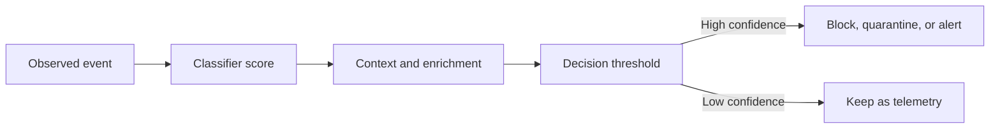
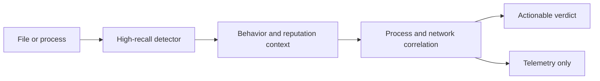
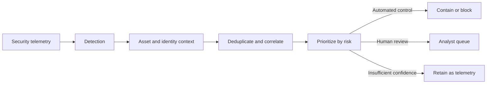

# Precision, recall, and the security alert factory

_Why classifier metrics are only the beginning: precision, recall, malware detection, EASM, and the operational cost of false alerts._

---

A security product reports 99% detection accuracy. Everyone feels reassured.

Then the alerts arrive.

The SOC receives findings about administrative tools, test systems, unusual but legitimate scripts, duplicate events, and vulnerabilities that do not apply to the asset in question. Analysts start closing alerts in batches. Some stop investigating low-severity detections altogether.

The classifier may be doing exactly what it was measured to do. The measurement was simply not measuring whether the security operation could function.

Precision and recall are useful because they describe different kinds of mistakes. They are not enough because a detection system does more than classify. It discovers, enriches, correlates, prioritizes, and finally asks a person or an automated control to do something.

## The detector is not the decision

A classifier usually produces a score. The product turns that score into a decision by applying a threshold.

A malware model might assign a file a 0.93 probability of being malicious. An EASM system might assign an internet-facing host a 0.81 probability of belonging to an organization. A SOC tool might give a network event a high-risk score.

None of those scores is an action yet.

The system still has to decide whether to quarantine the file, add the host to an inventory, create an analyst alert, or do nothing. Machine-learning documentation makes the same distinction: predicting a probability and deciding what to do with it are separate problems.[^1]



This separation matters because the cost of a mistake depends on the action. A false positive that adds an item to a review queue is inconvenient. A false positive that blocks a production binary is an outage. A false negative in a malware sandbox may be harmless if another control catches the sample, or serious if the file reaches an endpoint.

The model does not know any of that unless the surrounding system gives it the relevant context.

## A confusion matrix is a map of consequences

For a binary classifier, every prediction falls into one of four cells. A confusion matrix records the number of observations in each cell.[^2]

|  | Actually positive | Actually negative |
|---|---:|---:|
| **Predicted positive** | True positive (TP) | False positive (FP) |
| **Predicted negative** | False negative (FN) | True negative (TN) |

Take malware detection. Let the positive class mean malicious.

- A **true positive** is malicious software correctly detected
- A **false positive** is benign software incorrectly classified as malicious
- A **false negative** is malicious software that passes as benign
- A **true negative** is benign software correctly allowed through

The usual metrics answer different questions:

```text
precision = TP / (TP + FP)
recall    = TP / (TP + FN)
```

**Precision** asks: of everything we called malicious, how much really was malicious?

**Recall** asks: of everything that really was malicious, how much did we find?

A security engineer can remember the distinction this way:

> Recall describes what the detector misses. Precision describes what the operator has to endure.

The false-positive rate is different again:

```text
false_positive_rate = FP / (FP + TN)
```

It measures the share of benign items that were flagged. Precision measures the share of flagged items that were genuinely positive. The two numbers can look very different when the positive class is rare.

## Why accuracy breaks first

Security data is usually imbalanced. In malware scanning, most files are benign; in network monitoring, successful compromises may be rare; in EASM, discovery starts from candidates that still need attribution.[^3][^4][^7]

That makes accuracy a dangerous headline number. A system can be highly accurate while being poor at finding the rare thing that matters.

Consider an illustrative malware-scanning workload of 10 million files:

- 0.1% of files are malicious: 10,000 files
- The detector has 99% recall: it finds 9,900 of them
- 9,990,000 files are benign

Now compare two false-positive rates.

| False-positive rate | True positives | False negatives | False positives | Total alerts | Precision |
|---:|---:|---:|---:|---:|---:|
| 1% | 9,900 | 100 | 99,900 | 109,800 | 9.0% |
| 0.01% | 9,900 | 100 | 999 | 10,899 | 90.8% |

The first detector has a 1% false-positive rate. That sounds small until it is applied to almost ten million benign files. Only about one alert in eleven is a real malicious file.

The second detector improves the false-positive rate by a factor of one hundred. It produces ten times fewer alerts and its precision is above 90%, while recall is unchanged in this example.

The numbers are invented, but the arithmetic is the point. When positives are rare, a small false-positive rate can dominate the queue. This is why precision-recall curves are especially useful for imbalanced classification problems.[^3]

It is also why a benchmark result without prevalence is incomplete. A model can look excellent on a balanced test set and behave very differently on a production stream where the positive class is one in a thousand.

## Malware detection has several different positives

“Malware detection” sounds like one classification problem. In practice, the positive label depends on what is being classified.

A system might classify:

- A file as malicious or benign
- A process as suspicious or ordinary
- A behavior as an attack technique or normal administration
- A domain as command-and-control infrastructure or an ordinary service
- A sample as belonging to a known family or to an unknown family

Those are related tasks, not interchangeable ones.

A signature can be precise for a known sample and have no recall against a new variant. A heuristic can catch a wider family and flag more legitimate software. A behavior detector can see process injection or unusual memory allocation, but the same behavior may be used by security tools, debuggers, installers, or enterprise management software.

The cost of a false negative is usually obvious: something malicious is missed. The cost of a false positive depends on the next step:

- Quarantine can interrupt a user or break an application
- A sandbox queue consumes compute
- An endpoint alert consumes analyst time
- An automated block can create an outage
- A low-confidence signal can be useful telemetry if it is not presented as a verdict

This is why real detection products tend to be layered. A broad detector can gather candidates. Reputation, signer information, prevalence, process ancestry, network context, and historical observations can then narrow the set before an expensive action is taken.[^10]



The first stage does not need to be the final judge. It needs to avoid throwing away useful evidence. The later stages can spend more time on fewer candidates.

## EASM is a chain of classification problems

External attack surface management is commonly described as the continuous discovery and mapping of internet-facing infrastructure. Microsoft describes Defender EASM as a service that discovers and maps an organization's digital attack surface; Mandiant describes the category as continuous discovery of internet-facing assets and cloud resources, followed by technology and exposure assessment.[^4]

That description hides several separate classification problems.

Imagine an EASM pipeline starting with a company domain:

1. Discover a candidate domain, IP address, certificate, host, or cloud resource
2. Decide whether it belongs to the organization
3. Decide whether it is actually internet-facing and reachable
4. Identify the technology and configuration
5. Decide whether a vulnerability applies
6. Prioritize the result for remediation

The first stage wants recall. Missing an unknown production host defeats the purpose of discovery.

The second stage wants precision. A large inventory full of unrelated assets is not useful just because it is large.

The later stages need their own labels. A vulnerability may exist in a product version but not be exploitable in the observed configuration. An exposed service may be owned by a subsidiary, a vendor, or nobody in the organization anymore. The answer is not always a clean yes or no.

NIST defines an attack surface as the set of points on a system boundary where an attacker can try to enter, cause an effect, or extract data.[^5] EASM then adds an attribution question: which of the points found from the outside belong to the organization being assessed?

That means “EASM accuracy” is not one number. At minimum, an evaluation should say which stage it measures:

| Stage | Positive means | Main failure |
|---|---|---|
| Discovery | The asset exists in the target's external surface | Missed asset or irrelevant candidate |
| Attribution | The asset belongs to the target organization | Wrong owner or missed ownership |
| Exposure | The service is reachable and relevant | Incorrect exposure status |
| Applicability | The finding affects this instance | Inapplicable vulnerability |
| Prioritization | The result deserves action now | Important work buried or noise escalated |

A system can have high discovery recall and poor attribution precision. It can also have a precise inventory that is incomplete because its discovery process was too conservative.

Those are different trade-offs. Reporting one score hides them. The same warning applies to every stage of the pipeline: measure the task that produces the decision, not a nearby task that is easier to label.

## Alert fatigue is not a confusion-matrix cell

A false positive is a classification error. Alert fatigue is what happens when the whole workflow repeatedly asks humans to process low-value output.[^6]

The distinction matters because not every painful alert is a false positive.

A 2022 qualitative study of SOC analysts found that practitioners perceived very high false-positive rates, but many of the cases were better described as **benign triggers**: the security tool had correctly matched a real event, but the behavior had a legitimate explanation in that environment.[^6] The authors also described alarm validation as tedious and identified reliability, explainability, analytical support, context, and transferability as properties that could improve alarm handling.

That gives us at least three categories that are often thrown into the same “false positive” bucket:

- **Wrong alert** — the detector classified benign activity as malicious
- **Benign trigger** — the detector correctly observed the behavior, but it was authorized or expected
- **Attack attempt** — hostile activity was detected, but it did not result in a compromise

These categories require different fixes. A wrong alert may need a model or rule change. A benign trigger may need asset context, an exception, or a better policy. An attack attempt may be valuable detection even though it did not become an incident.

A large empirical study of one SOC illustrates why the labels matter. The researchers analyzed 115 million network alerts collected over four years. The SOC saw between 24,000 and 134,000 alerts per day, while only 0.01% of the alerts were associated with successful attacks in their ground-truth data. They classified 27% as attack attempts and 49% as benign triggers. The study also reported that post-attack investigation took 53 days on average.[^7]

Those percentages are not a universal benchmark for every SOC. The dataset, sensors, organization, and definition of “successful attack” all matter. But the paper makes a useful point: an alert stream is not a clean list of incidents waiting to be read. It contains signals, attempts, expected behavior, duplicates, and mistakes.

A model that optimizes only the first classification step cannot solve that problem by itself.

## The threshold is a policy decision

Most classifiers produce a score and use a threshold to turn it into a label. Changing the threshold changes the operating point on the precision-recall curve.

Lowering the threshold usually admits more candidates. That can recover true positives, but it can also increase the number of false positives. Raising it usually makes the queue smaller and more precise, but risks missing weaker signals. The exact curve can have irregular steps, so precision does not have to decrease smoothly as recall rises.[^3]

The default threshold is rarely sacred. In common machine-learning APIs, a probability above 0.5 becomes the positive class by default. That is a convenient convention, not a law of security operations. The threshold should reflect the cost of the action and the capacity of the team.[^8]

A simple operational objective might look like this:

```text
expected_cost(threshold) =
    missed_threats * cost_of_miss
  + false_alerts * cost_of_review
  + high_impact_actions * cost_of_disruption
```

The terms will not have precise euro values. They still force the right questions:

- How many alerts can the team investigate per hour?
- What happens when an alert is ignored?
- Is the output allowed to block production, or only request review?
- Which evidence would make an analyst trust the result?
- Should the system optimize for the average day or for a rare high-impact event?

A high-recall detector may be the right first stage. It may be the wrong source for a page-and-wake-up-the-on-call alert.

## Measure the factory, not only the classifier

The useful unit is the complete path from observation to action.



Each stage can change the effective precision and recall:

- Discovery can increase recall by collecting more candidates
- Enrichment can increase precision by adding ownership and prevalence
- Correlation can reduce duplicate alerts
- Prioritization can move the most useful findings to the front
- Routing can prevent low-confidence signals from interrupting people

The final product is not the model score. It is the set of decisions that the organization makes after the model has spoken.

A reasonable evaluation report should therefore include more than accuracy, F1, or an area-under-the-curve number:

| Metric | Operational question |
|---|---|
| Recall | How many known threats did we miss? |
| Precision | How often is a positive result worth investigating? |
| False-positive rate | How much benign activity is being flagged? |
| Prevalence | How common is the positive class in production? |
| Alert volume | Can the team process the output? |
| Duplicate rate | How many alerts describe the same underlying event? |
| Time to triage | How long before a person understands the result? |
| Actionability | How often does a finding lead to a useful decision? |
| Backlog age | How long do unresolved findings remain visible? |

NIST's security measurement guidance makes the same broader point: measures should support technical and management decisions, rather than exist as isolated numbers.[^9]

## The conclusion

Precision and recall are not competing moral positions. They describe different error patterns.

Recall tells you how much of the threat you leave behind. Precision tells you how much of the queue deserves attention. Neither tells you whether the alert contains enough context to act, whether ten alerts represent one incident, or whether the team has any capacity left at 17:00 on a Friday.

For malware detection, start with the cost of missing a sample and the cost of disrupting a benign one. For EASM, separate discovery from attribution, exposure, applicability, and prioritization. For SOC alerting, separate wrong alerts from benign triggers and attack attempts.

Then measure the whole pipeline.

The goal is not the best classifier in a notebook. It is a detection system whose mistakes fit inside the organization's ability to respond.

## References

[^1]: scikit-learn developers. "Metrics and scoring: quantifying the quality of predictions." scikit-learn documentation. https://scikit-learn.org/stable/modules/model_evaluation.html

[^2]: scikit-learn developers. "confusion_matrix." scikit-learn documentation. https://scikit-learn.org/stable/modules/generated/sklearn.metrics.confusion_matrix.html

[^3]: scikit-learn developers. "Precision-Recall" and "Precision-recall curves." scikit-learn documentation. https://scikit-learn.org/stable/auto_examples/model_selection/plot_precision_recall.html

[^4]: Microsoft. "Defender External Attack Surface Management"; Jonathan Cran, Mandiant. "Making Sense of External Attack Surface Management: The Current and Future State of the Category." https://learn.microsoft.com/en-us/azure/external-attack-surface-management/ ; https://cloud.google.com/blog/products/identity-security/external-attack-surface-management/

[^5]: NIST. "attack surface - Glossary." https://csrc.nist.gov/glossary/term/attack_surface

[^6]: Bushra A. Alahmadi, Louise Axon, and Ivan Martinovic. (2022). "99% False Positives: A Qualitative Study of SOC Analysts' Perspectives on Security Alarms." 31st USENIX Security Symposium. https://www.usenix.org/conference/usenixsecurity22/presentation/alahmadi

[^7]: Limin Yang et al. (2024). "True Attacks, Attack Attempts, or Benign Triggers? An Empirical Measurement of Network Alerts in a Security Operations Center." 33rd USENIX Security Symposium. https://www.usenix.org/conference/usenixsecurity24/presentation/yang-limin

[^8]: scikit-learn developers. "Tuning the decision threshold for class prediction." scikit-learn documentation. https://scikit-learn.org/stable/modules/classification_threshold.html

[^9]: NIST. "Measurements for Information Security." https://csrc.nist.gov/Projects/measurements-for-information-security

[^10]: NIST. (2013). "Guide to Malware Incident Prevention and Handling for Desktops and Laptops (SP 800-83 Rev. 1)." https://doi.org/10.6028/NIST.SP.800-83r1


