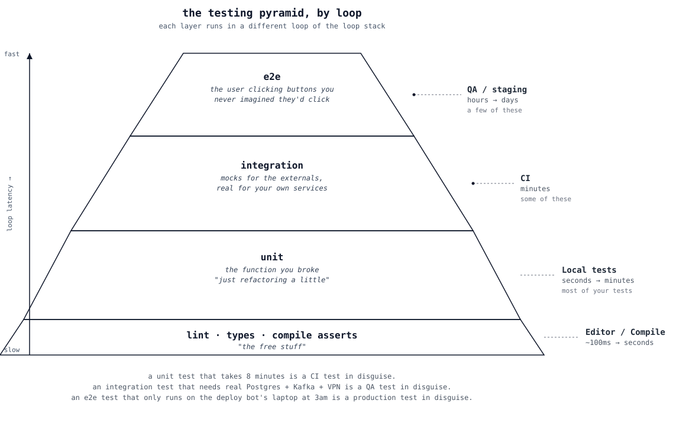

# The Loop Stack and the Testing Pyramid Are the Same Picture

The testing pyramid has three layers: unit at the bottom, integration in the middle, e2e at the top. The loop stack has six layers: editor, compile, local tests, CI, QA, production. The thing nobody draws is that they line up.

The pyramid is right about proportions. Most of your tests should be cheap, fast, and live at the bottom. A few should be expensive, slow, and live at the top.

The loop stack is right about placement. Each test belongs at the loop where it actually runs in your feedback window — which is to say, where you'll see it fail while you still care.

A unit test that takes 8 minutes is a CI test in disguise. An integration test that needs a real Postgres and a real Kafka and a real "the test runner has VPN turned on" is a QA test in disguise. An e2e test that only runs on the deploy bot's laptop at 3am is a production test in disguise.

The two pictures make the same point from two angles. The pyramid says "few tests, slow, at the top." The loop stack says "each loop has a job, and the test at that loop is what makes the job earn its keep." Same insight. Different framing.

Draw them together once and you stop having arguments about test counts.
